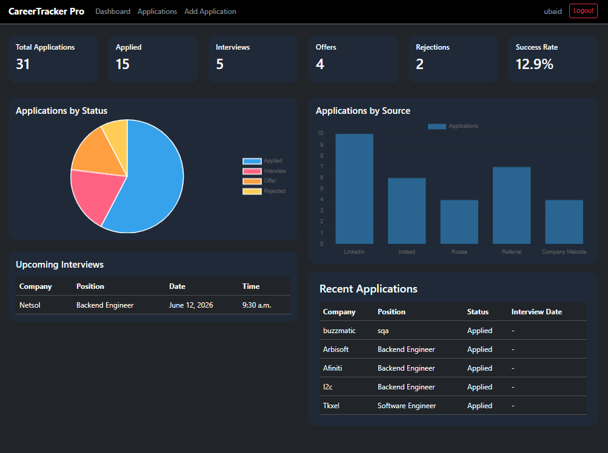
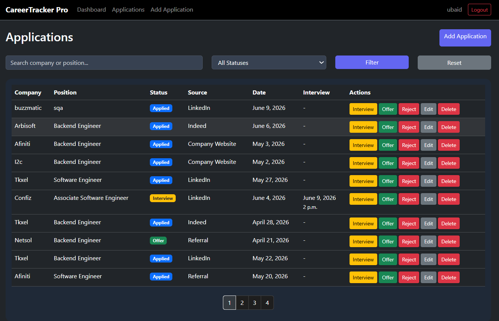
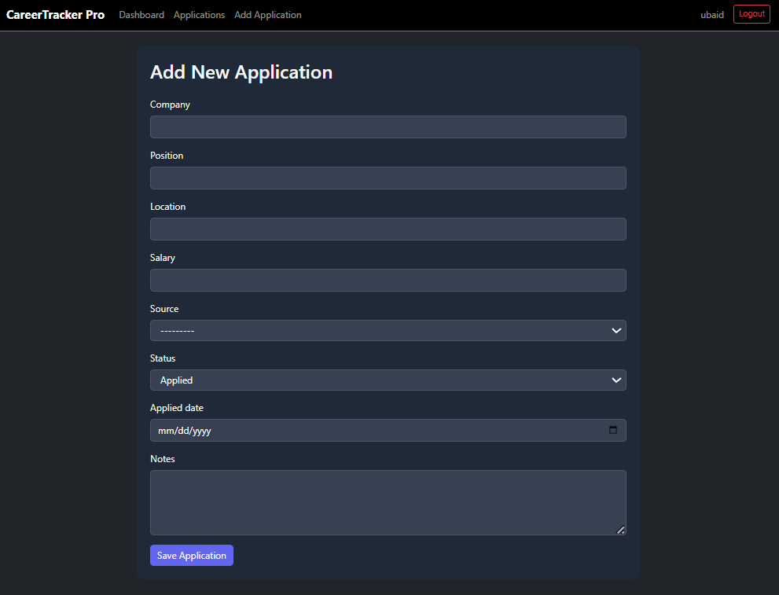
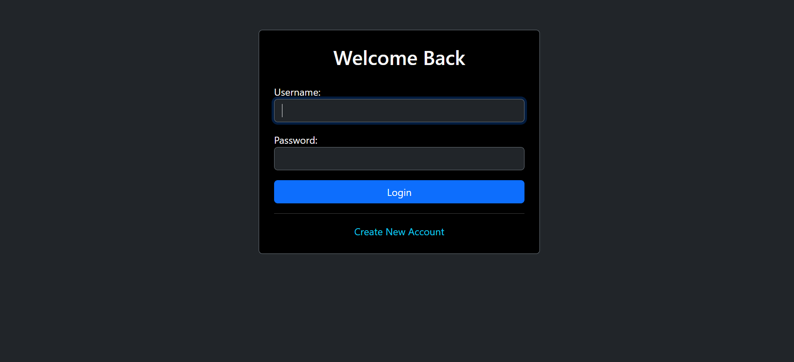

# CareerTracker Pro

A full-stack Django web application designed to help job seekers efficiently manage and track their job applications throughout the hiring process.

CareerTracker Pro provides application management, interview scheduling, analytics dashboards, authentication, search, filtering, pagination, and REST API support in a modern dark-themed interface.

---

## Features

### Authentication System

- User Registration
- User Login
- User Logout
- User-specific Data Ownership
- Protected Routes using Django Authentication

### Job Application Management

- Create Applications
- View Applications
- Update Applications
- Delete Applications
- Track Hiring Progress

Supported Statuses:

- Applied
- Screening
- Interview
- Offer
- Rejected

### Interview Scheduling

- Interview Date Tracking
- Interview Time Tracking
- Upcoming Interview Dashboard
- Interview Validation Rules

### Analytics Dashboard

- Total Applications
- Applied Applications
- Interviews Scheduled
- Offers Received
- Rejections
- Success Rate Calculation

### Search & Filtering

- Search by Company Name
- Search by Position
- Filter by Status

### Pagination

- Efficient Navigation for Large Datasets
- User-Friendly Page Controls

### Data Visualization

- Application Status Distribution (Pie Chart)
- Application Sources Analysis (Bar Chart)

### REST API Support

Implemented using Django REST Framework.

Available Endpoints:

- Applications List API
- Application Details API

Future frontend or mobile applications can easily integrate with these endpoints.

### Application Sources

Applications can be tracked from multiple sources:

- LinkedIn
- Rozee.pk
- Indeed
- Referral
- Company Website

---

## Screenshots

### Dashboard Overview



Dashboard analytics with application statistics and charts.

---

### Application Management



Application tracking, search, filtering, status badges, and pagination.

---

### Add Application



Form-based application creation and editing workflow.

---

### Authentication



Secure user registration and login system.

---

## Tech Stack

### Backend

- Python
- Django
- Django REST Framework (DRF)

### Frontend

- HTML5
- CSS3
- Bootstrap 5
- Chart.js

### Database

- SQLite

### Version Control

- Git
- GitHub

---

## Key Concepts Implemented

### Django MVT Architecture

- Models
- Views
- Templates

### Authentication

- Login System
- Registration System
- User Ownership

### Database Design

- Application Model
- User Relationships
- Status Management

### Dashboard Analytics

- Aggregation Queries
- Success Rate Calculations
- Data Visualization

### REST APIs

- Serializers
- API Views
- JSON Responses

### Frontend Features

- Responsive Design
- Bootstrap Components
- Charts
- Dynamic UI

---

## Project Structure

```text
careertracker-pro/
│
├──core/
│
├── tracker/
│   ├──templates/
│   ├── models.py
│   ├── views.py
│   ├── forms.py
│   ├── urls.py
│   ├── serializers.py
│   └── api_views.py
│
├── screenshots/
│
├── requirements.txt
│
└── manage.py
```

---

## API Endpoints

### Get All Applications

```http
GET /api/applications/
```

### Get Single Application

```http
GET /api/applications/<id>/
```

Example Response:

```json
{
    "id": 1,
    "company": "Systems Limited",
    "position": "Python Developer",
    "status": "Interview"
}
```

---

## Future Improvements

Planned enhancements:

- Resume Management
- Email Notifications
- Interview Reminders
- AI Job Insights
- PostgreSQL Integration
- Docker Deployment
- Cloud Hosting
- Multi-User SaaS Version

---

## Learning Outcomes

This project strengthened practical experience in:

- Django Development
- Django REST Framework
- Authentication Systems
- CRUD Operations
- Database Modeling
- Dashboard Design
- Data Visualization
- REST API Development
- Git & GitHub Workflows
- Full-Stack Web Development

---

## Author

**Ubaid**

Master's in Computer Science

Python • Django • Machine Learning • Software Engineering